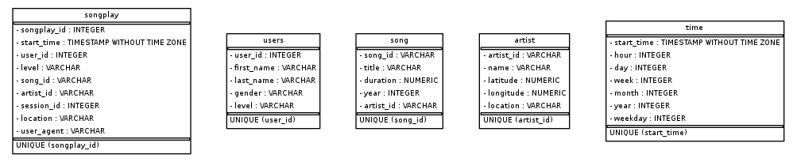

# Project created to analyze the database from sparkfy. 

All Json files in the directory were read and separated into a format that can be easily queried. 

## Project File Content

1. data: contains the original json files
2. create_tables.py: as the name implies, this file creates the tables used in the project, as well as cleaning any existing table data before its execution
3. etl.ipynb: file used in the creation of the project, contains guidelines and step-by-step instructions
4. README.md: this file.
5. sql_queries.py: this file defines the tables that are created when running create_tables.py. It also declares how the data is inserted into theses tables.
6. test.ipynb: file used for testing the db
7. examples.ipynb: some example of queries and plots that can be made using this new format and tables.
8. sparkifydb_erd.png: ERD (Entity Relationship Diagram) image from the tables in the database
9. create_erd.ipynb: simple code for generating the database's ERD 
10. etl.py: this file integrates the database, the tables and the raw json files provided by sparkfy.  

## Tables and ERD 
The following tables were created: 

- songplay = [songplay_id, start_time, user_id, level, song_id, artist_id, session_id, location, user_agent] **PK: songplay_id**

- song = [song_id, title, duration, year, artist_id] **PK: song_id**

- users = [user_id, first_name, last_name, gender, level] **PK: user_id**

- artist = [artist_id, name, latitude, longitude, location] **PK: artist_id**

- time = [start_time, hour, day, week, month, year, weekday] **PK: start_time**

As the main table, 'songplay' gathers all primary information (keys) that can be used to access information on the other tables. For example, 'user_id' can be selected to extract first name, last name and level of that specific user from 'users' table. 

## Running

In order to successfully run the project, the user must follow theses instructions in order:

1. Open a python 3 console
2. Run create_tables.py (this can be done typing `!python create_tables.py`)
3. Run etl.py (this cab be done typing `!python etl.py`)

## Results

After successfully running the scripts int the section above, the user can then choose to open the [test](test.ipynb) OR [examples](examples.ipynb) files to verify the data. 
Some of the already researched outcomes include:
- the number of paid x free users 
- which users listened to the most songs per session 
- the average distribution of songs by duration

